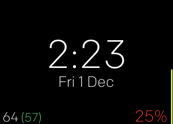

# Fitbit-Clock-Face

 It has:
- The time in 12 hr format
- Date as 'day date month'
- Both of those in the middle
- Current heart rate and resting heart rate in the bottom left corner
- The colour of the HR changes depending on the zone (white, yellow, orange, red)
- The Size of the HR text increases as the heart rate does (up to a point)
- Bottom right is the steps as a percentage of your goal, coloured depending on how close you are to you goal compared to how far through the day we are
- Top left is the battery percentage, but it only displays if the battery is less than 50%
